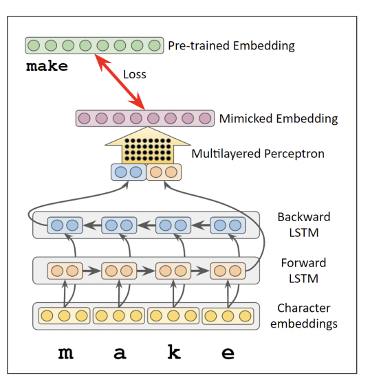

## Introduction
PyTorch implementation of [Mimicking Word Embeddings using Subword RNNs](https://arxiv.org/abs/1707.06961) (EMNLP 2017).


The original [repo](https://github.com/yuvalpinter/Mimick/tree/master/mimick) of the model is implemented in [dynet](http://dynet.io/), so I reimplemented the model using PyTorch.

## Usage
```
python main.py [arguments]
```

## Arguments
````
-h, --help        Help infomation
--char_embed      Embedding size of characters
--embedding       File path of original word embedding
````

## Experiment Result
| Dataset | Vocabulary | Test Cosine Sim |
|---------------------|------------|-------------|
| GloVe.6B.300 | 400K | 0.322 |